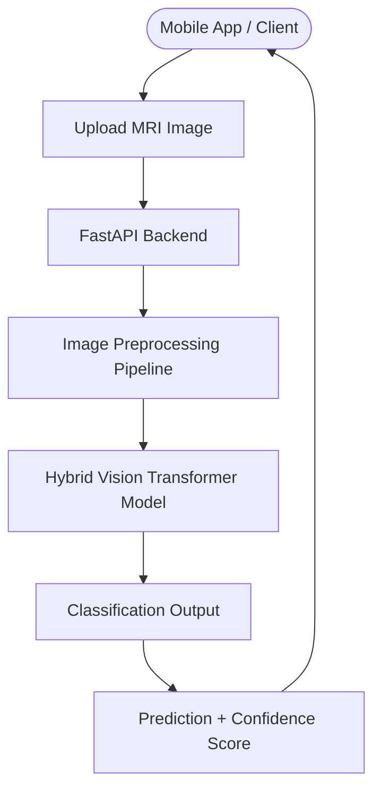

<div align="center">

# 🧠 AlzVision AI 🧠

### AI-Powered Alzheimer MRI Analysis using Vision Transformers

_Intelligent medical image analysis with deep learning and mobile integration_

</div>

---

## 📋 Overview

AlzVision AI is an AI-powered medical image analysis system designed to detect Alzheimer’s disease stages from MRI scans using deep learning and computer vision.

The project integrates a hybrid Vision Transformer (ViT) model with a FastAPI backend and mobile-ready architecture, enabling real-time MRI analysis through modern applications.

The system transforms raw MRI images into meaningful clinical insights by providing:

- Alzheimer stage classification
- Confidence scoring
- Real-time inference via API
- Mobile app integration

This project demonstrates practical deployment of deep learning models beyond experimentation — focusing on real-world usability and scalable AI architecture.

---

## 🏗️ System Architecture



---

## 🧠 AI Model

The system uses a hybrid Vision Transformer architecture trained on Alzheimer MRI datasets to classify brain scans into four stages:

- Non_Demented
- Very_Mild_Demented
- Mild_Demented
- Moderate_Demented

Key Features:

- Deep learning-based MRI analysis
- TensorFlow SavedModel deployment
- Optimized preprocessing pipeline
- Mobile-friendly inference API

---

## 📁 Project Structure

```
ALZHEIMERS_PROJECT/

├── backend/
│   ├── main.py
│   ├── model_loader.py
│   ├── preprocess.py
│   ├── alzheimers_model/
│   └── venv/

├── dataset/
│   ├── MildDemented/
│   ├── ModerateDemented/
│   ├── NonDemented/
│   └── VeryMildDemented/

├── alzheimers_hybrid_vit.ipynb
├── .gitignore
```

---

## ⚙️ Backend API

### POST `/predict`

Upload MRI image.

Example response:

```json
{
  "prediction": "Moderate_Demented",
  "confidence": 0.81
}
```

---

## 🧪 Image Processing Pipeline

1. MRI image uploaded via API
2. Image resized to model input size
3. Normalization applied
4. Tensor conversion
5. Model inference
6. Prediction + confidence returned

---

## 🚀 Running the Backend

Activate environment:

```bash
cd backend
source venv/bin/activate
```

Run FastAPI:

```bash
uvicorn main:app --reload
```

Open:

```
http://localhost:8000/docs
```

---

## 📱 Mobile Integration

- React Native app uploads MRI image
- API returns prediction
- UI displays Alzheimer stage with confidence.

---

## 🔬 Technologies Used

- Python
- TensorFlow
- Vision Transformers (ViT)
- FastAPI
- Deep Learning
- Medical Image Processing
- React Native

---

## 🎯 Future Improvements

- Improved model accuracy
- Explainable AI visualizations
- Real-time camera scanning
- On-device inference
- Clinical reporting interface

---

## 👨‍💻 Author

Aayush Kumar

---

## ⭐ License

Educational and research purposes.
